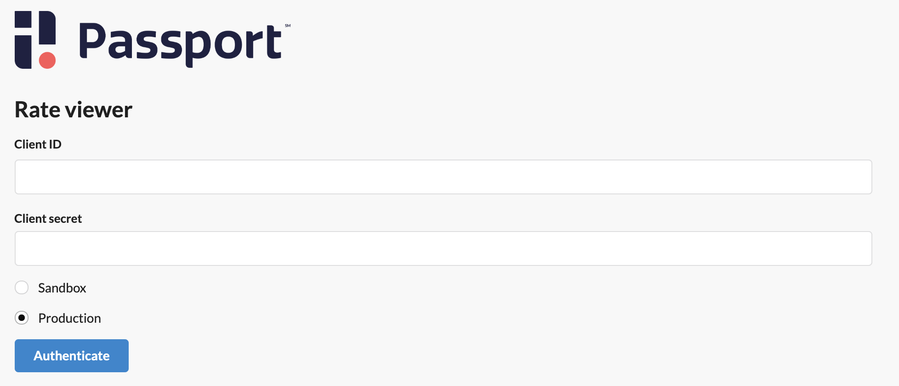

## Passport Rate Viewer

This tool allows registered partners to view zone and rate information in all available environments. All information is pulled from [Passport's parking APIs](https://developer.passportinc.com/parking/full).

Credentials can be acquired by [reaching out to Passport](https://www.passportinc.com/resources/developers/).